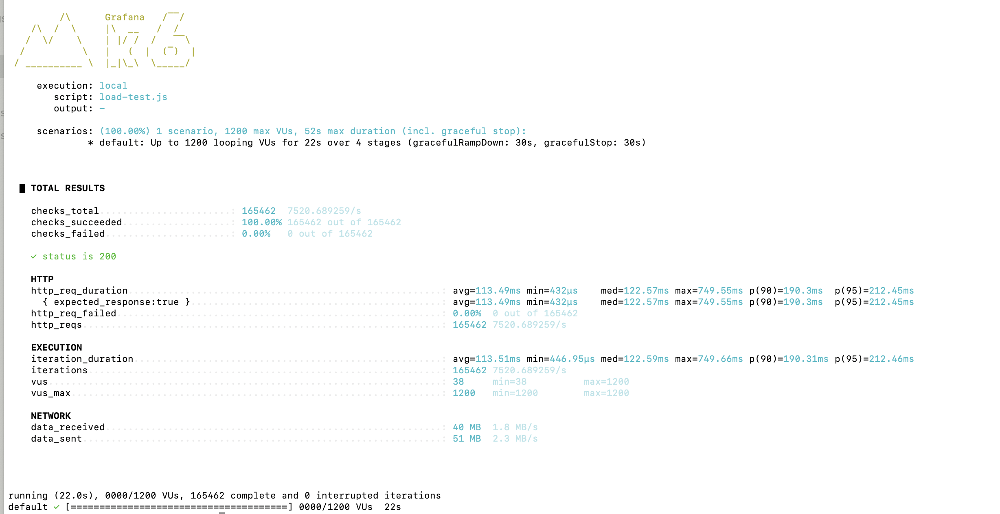
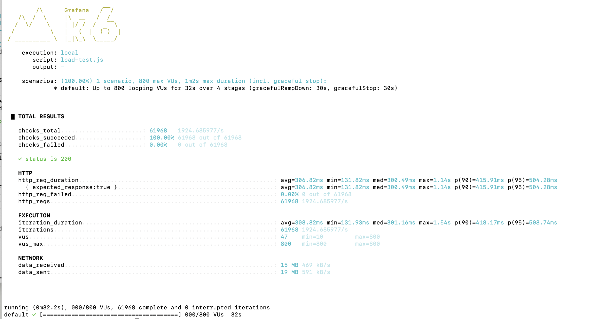

## Scalable Tracking Number Generator API

### Overview
This project implements a scalable, efficient RESTful API for generating 
unique tracking numbers for parcels. Built with Spring Boot(3.5.3) and
Spring WebFlux, it is designed for high concurrency and horizontal 
scalability.

### Functional Features
- **GET /next-tracking-number** endpoint to generate unique tracking numbers along with created_at timestamp.
- Generated tracking numbers match the pattern: `^[A-Z0-9]{1,16}$`.
- Ensures uniqueness across multiple requests and instances
  - **Uniqueness Guarantee:** The tracking number generation logic uses a monotonically increasing counter
  to guarantee uniqueness. The number is then encoded using a bijective method using a java library from
  https://sqids.org/. This ensures that each generated tracking number is unique. To make the counter globally available 
  to all server instances when the system scales horizontally, the
  counter is maintained in a distributed cache(Redis). To reduce network calls to redis,
  a local counter 
  is used to prefetch next tracking numbers in batches. 
- URL parameters validation in the API.

### Non-functional Features
- Low latency in tracking number generation.
- Handles high concurrency and is horizontally scalable.
- Fault tolerance of the monotonically increasing counter is ensured by using managed persistent redis service. 
Backup and replication 
 can be configured in the redis service to ensure that the counter value is not lost in case of a failure. To ensure
 further fault tolerance, we can use Redis function to backup counter value to another persistent storage after every update.
 Since the api server fetched the next 10000 tracking numbers in a batch, the counter value is updated only once 
 in every 10000 requests.

### API Specification
Interactive API documentation is available here
http://34.70.109.139/swagger-ui.html

#### API Endpoint
```
GET /next-tracking-number
```

#### Query Parameters
| Name                  | Type    | Description                                                      | Example                        |
|-----------------------|---------|------------------------------------------------------------------|--------------------------------|
| origin_country_id     | String  | Origin country code (ISO 3166-1 alpha-2)                         | MY                             |
| destination_country_id| String  | Destination country code (ISO 3166-1 alpha-2)                    | ID                             |
| weight                | String  | Order weight in kilograms (up to 3 decimal places)               | 1.234                          |
| created_at            | String  | Order creation timestamp (RFC 3339 format)                       | 2018-11-20T19:29:32+08:00      |
| customer_id           | String  | Customer UUID                                                    | de619854-b59b-425e-9db4-943979e1bd49 |
| customer_name         | String  | Customer name                                                    | RedBox Logistics               |
| customer_slug         | String  | Customer name in slug-case/kebab-case                            | redbox-logistics               |


#### Response Schema
| Field            | Type   | Description                                 |
|------------------|--------|---------------------------------------------|
| tracking_number  | String | The generated unique tracking number         |
| created_at       | String | Timestamp when the tracking number was generated (RFC 3339 format) |

#### Example Response
```
{
  "tracking_number": "A1B2C3D4E5F6G7H8",
  "created_at": "2025-06-28T12:34:56+00:00"
}
```

### Setup & Run
#### Prerequisites
- Java 21 
- Docker

#### Local Development
1. **Clone the repository:**
   ```sh
   git clone git@github.com:saila-lopa/tracking-number-generator.git
   cd tracking-number-generator
   ```
2. **Build the project:**
   ```sh
   ./gradlew build
   ```
3. **Spin up a docker container for Redis service.** 
   ```sh
   docker run -d --name redis -p 6379:6379 redis
   ```
4. **If you have a different redis configuration, Create a `.env` file in the root directory with the following content:**
   ```env
   REDIS_HOST=YOUR_REDIS_HOST
   REDIS_PORT=YOUR_REDIS_PORT
   ```
3. **Run the application:**
   ```sh
   ./gradlew bootRun
   ```
   The API documentation should be available at `http://localhost:8080/swagger-ui.html`.

#### Running using docker
To run the application in a Docker container, follow these steps:
1. **Build Docker image:**
   ```sh
   docker build -t tracking-number-generator .
   ```
2. **Run Docker container:**
   ```sh
   docker run -p 8080:8080 tracking-number-generator
   ```

### Testing
- Run all tests:
  ```sh
  ./gradlew test
  ```
- Test the API endpoint using `curl` or any HTTP client:
  ```sh
  curl "http://localhost:8080/next-tracking-number?origin_country_id=MY&destination_country_id=ID&weight=1.234&created_at=2018-11-20T19:29:32%2B08:00&customer_id=de619854-b59b-425e-9db4-943979e1bd49&customer_name=RedBox%20Logistics&customer_slug=redbox-logistics"
  ```

### Deployed Application
- **URL:** http://34.70.109.139/swagger-ui.html

### Results
The test cases in this repository initiated upto 100000 request to the number generator, and 
tested the uniqueness of those numbers. All the generated numbers were unique, indicating
the correctness of the implementation.

We also ran some load tests using k6. This following configuration was used in local environments:
```javascript
import http from 'k6/http';
import { check, sleep } from 'k6';

export let options = {
    stages: [
        { duration: '5s', target: 500 },    // ramp up to 500 VUs
        { duration: '5s', target: 1200 },   // ramp up to 1200 VUs
        { duration: '10s', target: 1200 },   // stay at 1200 VUs
        { duration: '2s', target: 0 },    // ramp down to 0 VUs
    ],
};

export default function () {
    const url = 'http://localhost:8080/next-tracking-number?origin_country_id=MY&destination_country_id=ID&weight=2.211&created_at=2018-11-20T19%3A29%3A32%2B08%3A00&customer_id=4dcccfe6-fc76-4adc-84d0-067982c24805&customer_name=RedBox%20Logistics&customer_slug=redbox-logistics';
    let res = http.get(url, {timeout: '3s'});
    check(res, {
        'status is 200': (r) => r.status === 200,
    });
}
````

#### Local results




#### Deployed results


### Note for Deployed results
The outcome in the deployed environment can be improved by increasing
the resources allocated to the server and increasing the number of pods 
in the kubernetes cluster. In the deployed environment, we had the following configuration:
```yaml
resources:
  limits:
    ephemeral-storage: 1Gi
  requests:
    cpu: 500m
    ephemeral-storage: 1Gi
    memory: 2Gi
```

And two api service pods were running in the kubernetes cluster.